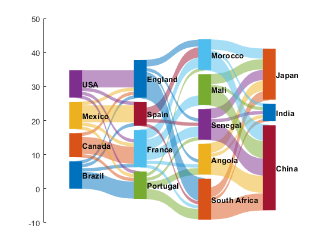

# SankeyPlot

Easy MATLAB-based sankey (or alluvial flow) plots. 

## Usage

Takes inputs of either CSV, JSON, or matfiles in the following format:
```matlab
 	% size(data) = N x 3, where N = number of links
	data = [{'input1', 'output1', amount};...
			{'input1', 'output2', amount}]
```
check the `sankey_master.m` file for more help with usage

## Example

```matlab
addpath('Example_Data')
load('sankey.mat') % Loading a default dataset
skp = SankeyPlot(data);
skp.preprocessData();
skp.createLinks();
skp.createNodes();
skp.createLabels();
```

Output:


From here you can change node and link colors as you please
